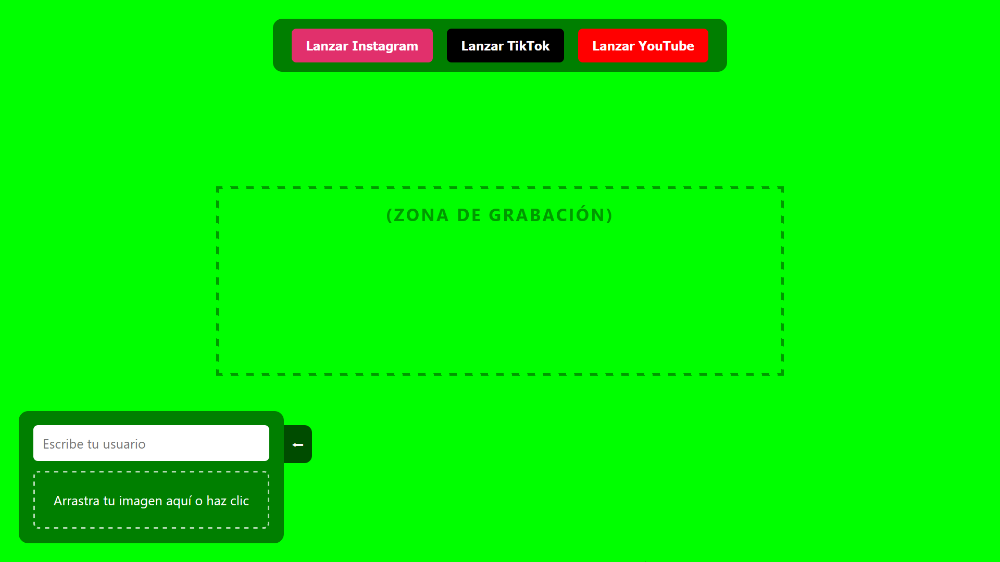
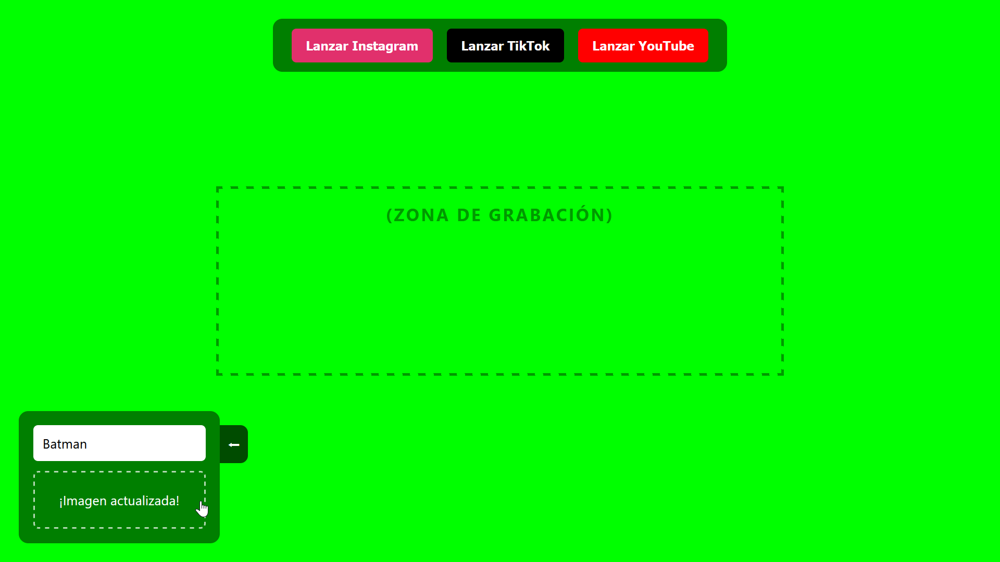
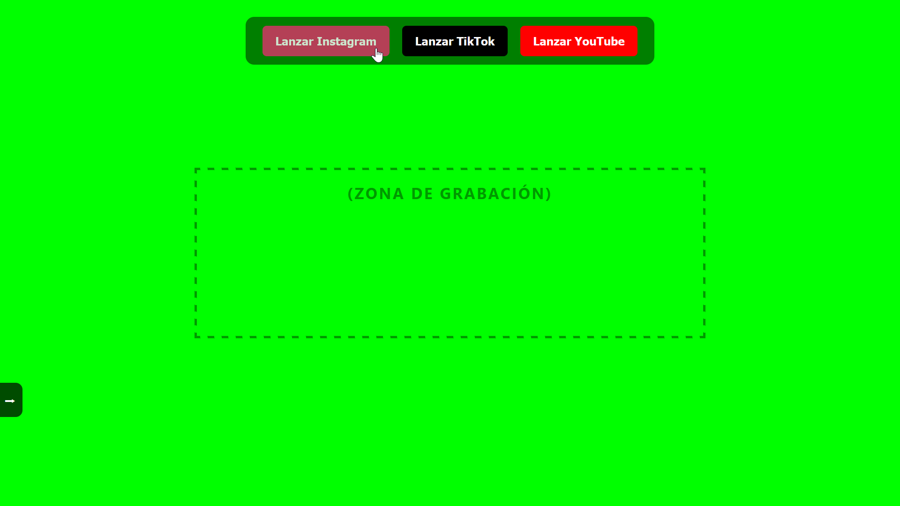
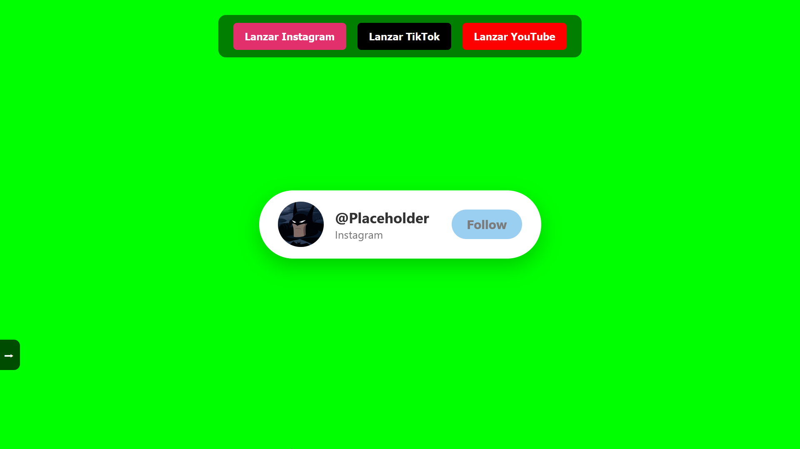

# Follow Animation Generator (Green Screen)

## 🚀 Live Demo
You can try the app directly in your browser here: 
👉 [Test the Follow Animation Generator](https://tu-usuario.github.io/tu-repositorio/)

---

A simple, customizable web-based tool to generate "Follow" and "Subscribe" animation pop-ups for Instagram, TikTok, and YouTube. Built specifically for content creators to record over a green screen (chroma key) background and overlay onto their videos.

## Features
* **Live Customization:** Update the username and profile picture in real-time.
* **Drag & Drop:** Easily upload your profile picture by dragging it into the drop zone.
* **Collapsible UI:** Hide the settings panel with a smooth animation so it doesn't interfere with your recording.
* **Recording Guide:** A visual dashed box shows exactly where the animation will appear, making it easy to crop your screen recording.
* **Auto-Hide Text:** The recording zone text automatically disappears the moment you launch an animation.

---

## How to Use

### 1. Setup & Customization
When you open the `index.html` file, you will see the green screen background, the top control buttons, the recording zone guide, and the settings panel in the bottom left corner.

### 2. Add Your Info
Type your desired username (e.g., your TikTok or Instagram handle) into the text input. Then, click on the dashed box or drag and drop an image file to update the profile picture. The box will display "¡Imagen actualizada!" when successful.

### 3. Hide the Settings Panel
Before you start recording your screen, you need a clean workspace. Click the left-arrow button (`⬅`) attached to the settings panel. 

### 4. Prepare to Record
The panel will smoothly slide off-screen, leaving only a small right-arrow tab (`➡`) visible. Now, set up your screen recording software (like OBS) to capture the area inside the dashed **(ZONA DE GRABACIÓN)** box.

### 5. Launch Animation!
Click any of the top buttons (Lanzar Instagram, Lanzar TikTok, or Lanzar YouTube). The "ZONA DE GRABACIÓN" text will disappear, and your customized animation will slide into view, click the follow button, and slide out. 

*(Example)*

## 🚀 TRY IT NOW
You can try the app directly in your browser here: 
👉 [Test the Follow Animation Generator](https://google.com)

---

## File Structure
* `index.html`: The main structure of the app.
* `style.css`: Contains all the styling, green screen background, and CSS animations.
* `launchingBtns.js`: Handles the logic for triggering the slide-in/slide-out animations and button state changes.
* `settings.js`: Manages the real-time customization (username input, image file reading) and the collapsible side panel.

## Notes for Creators
* **Chroma Key:** Set your video editor's chroma key color to `#00FF00` to make the background transparent.
* The animations last approximately 6 seconds. Make sure to record the entire duration from when you click the launch button until the card completely leaves the screen.